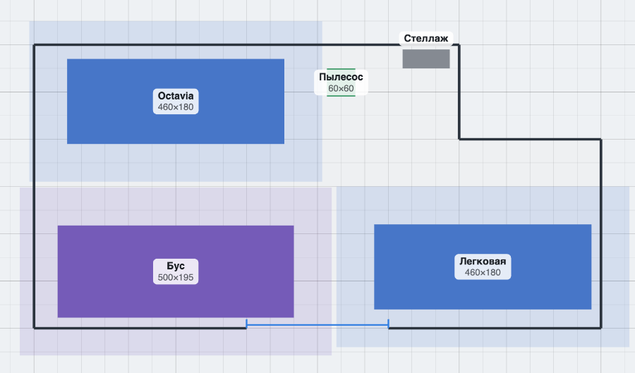
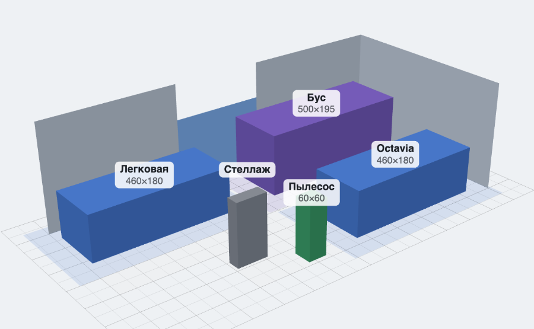

# Планировщик мойки

Веб-планировщик помещения автомойки. Задаёшь комнату по реальным размерам,
расставляешь машины и оборудование как боксы с реальными габаритами, смотришь
сверху и в 3D — и понимаешь, влезет ли и останется ли место ходить вокруг
с аппаратом высокого давления.

Главное отличие от мебельных планировщиков: у каждого объекта есть **зона
обслуживания** — отступ, в который никто не должен залезать. Вопрос не «влезет
ли машина», а «можно ли вокруг неё работать».

Тач — первый класс: рассчитано на iPad Safari. Мышь и клавиатура — второй.



Комната 1200×600 с выступом 300×200. Светлые поля вокруг машин — зоны
обслуживания, синяя линия внизу — ворота. Тот же план в 3D:



## Запуск локально

Приложение на ES-модулях, поэтому двойным кликом с диска не откроется —
нужен статический сервер:

```bash
python3 -m http.server 8000
```

Дальше `http://localhost:8000`.

## Открыть с iPad

iPad должен быть в той же Wi-Fi, туннель не нужен. Узнать адрес мака:

```bash
ipconfig getifaddr en0
```

На iPad открыть `http://<этот-адрес>:8000`. Чтобы работало как приложение,
без сафари-баров — «Поделиться» → «На экран Домой».

## Как пользоваться

**Комната.** Кнопка «Комната» → «Прямоугольник Д × Ш» задаёт коробку с нуля.
Выступы делаются в режиме «Правка стен»: тапнуть `+` на середине стены, чтобы
добавить вершину, и растащить вершины по местам. Точные числа удобнее вбивать
в таблицу вершин — она и ручки показывают одно и то же. Долгий тап по вершине
взводит её удаление, вершина краснеет; сдвинул палец — передумал.

**Ворота.** «Комната» → «+ Ворота» → тапнуть стену. Дальше отступ и ширина
полями.

**Объекты.** «+ Добавить» → карточка каталога. Объект появляется в центре
экрана, каталог остаётся открытым — можно поставить бус, две легковые и
пылесос подряд. Перетаскивание одним пальцем, привязка 10 см. У выбранного
объекта за торцом есть ручка поворота: шаг 15°, с зажатым Shift на десктопе —
свободно. Кнопки в шторке крутят на 90°.

**Что означают цвета.** Красный — объект наехал на другой или вылез за стену.
Оранжевый — пересеклись только зоны обслуживания: ездить можно, работать
тесно. Во время перетаскивания видны расстояния до ближайших стен.

**3D.** Один палец на пустом месте — облёт, два — приблизить и сдвинуть,
один палец на объекте — тащить его по полу. Ближние к камере стены не
рисуются, поэтому внутрь видно с любого ракурса.

**Варианты.** Раскладок можно держать несколько и переключаться мгновенно.
Тап по имени активного варианта — переименовать.

**Клавиши** (десктоп): `Delete` — удалить, `R` — повернуть на 90°,
`D` — дублировать, `Cmd/Ctrl+Z` и `Shift+Cmd/Ctrl+Z` — отмена и возврат,
колесо — зум, правая кнопка или пробел с зажатой левой — панорама.

## Обмен и файлы

Меню `⋯`:

- **Экспорт JSON** — сцена целиком одним файлом
  `carwash-{вариант}-{дата}.json`. На iPad уходит через системную шару —
  в Файлы, Telegram, AirDrop; на десктопе просто скачивается.
- **Скопировать JSON** — то же самое в буфер обмена, если шара не сработала.
- **Импорт JSON** — файлом или вставкой текста. Приезжает **новым вариантом**,
  текущий не трогает. Файл чужой версии не мигрируется, а честно отвергается.
- **Скриншот PNG** — текущий вид с подписями, тоже через шару.

Ничего не уходит в сеть: после загрузки страницы приложение не делает ни
одного сетевого запроса. Всё живёт в `localStorage` браузера, обмен между
устройствами — через экспорт и импорт.

## Тесты

Чистая математика лежит в `geometry.js` и покрыта тестами на встроенном
`node:test` — без Jest и вообще без зависимостей:

```bash
node --test
```

Тесты сами находятся в `tests/`. Запускать именно так, без пути: `node --test tests/`
на Node 24 падает — позиционный аргумент он пытается загрузить как модуль.
Один файл можно прогнать прицельно: `node --test tests/geometry.test.js`.

## Структура

| Файл | Что внутри |
|------|------------|
| `index.html` | разметка, importmap, метатеги PWA |
| `app.js` | состояние, конвейер отрисовки, панели, старт |
| `actions.js` | действия: комната, ворота, варианты, экспорт и импорт |
| `gestures.js` | жесты: пан, зум, выбор, драг, поворот, правка стен |
| `objects.js` | действия над объектами и расчёт коллизий |
| `scene3d.js` | Three.js: рендерер, камеры, сетка, рейкаст |
| `meshes.js` | построители геометрии: комната, стены, объекты, размеры |
| `geometry.js` | чистая математика — без DOM и Three |
| `catalog.js` | пресеты машин и оборудования |
| `storage.js` | localStorage, проверка сцены, история отмен |
| `io.js` | экспорт, импорт, снимок PNG, шара |
| `ui.js` | панели шторки и элементы формы |
| `strings.js` | все строки интерфейса |
| `style.css` | оформление |
| `vendor/` | Three.js, вшитый в репо (не с CDN) |
| `tests/` | тесты geometry.js |
| `scripts/make-icons.mjs` | генератор иконок PWA |

Three.js версии `0.185.1` лежит в `vendor/` целиком: на мойке интернет может
быть никакой, и CDN там не помощник. В r185 сборка разделена, поэтому рядом
с `three.module.min.js` обязателен `three.core.min.js` — он подтягивается
относительным путём. Импорты резолвит `<script type="importmap">` в
`index.html`.

Другой язык добавляется правкой одного файла: все тексты лежат в `strings.js`.

## Деплой на Cloudflare Pages

Репозиторий приватный, поэтому GitHub Pages не подходит (на бесплатном
тарифе он приватные репо не отдаёт). Cloudflare Pages отдаёт статику из
приватного репо бесплатно.

Подключить нужно один раз, руками:

1. Зайти на [dash.cloudflare.com](https://dash.cloudflare.com) → **Workers & Pages**
2. **Create** → вкладка **Pages** → **Connect to Git**
3. Разрешить доступ к репозиторию `ArbaCat/carwash-planner`
4. Настройки сборки:
   - **Framework preset** — `None`
   - **Build command** — оставить пустым
   - **Build output directory** — `/`
5. **Save and Deploy**

Дальше каждый `git push` в `main` разворачивается сам на
`https://carwash-planner.pages.dev`.

Если с Cloudflare не сложится — та же статика уезжает на Netlify
(`npx netlify-cli deploy --prod --dir=.`) или Vercel.

## Что проверено, а что нет

Проверено в браузере на десктопе при размере окна как у iPad (768×1024),
мышью и клавиатурой:

- комната 1200×600 с выступом 300×200 задаётся и ручками, и таблицей, обе
  правки показывают одно и то же;
- ворота 300 см на длинной стене видны и сверху, и в 3D;
- бус, две легковые, пылесос и стеллаж добавляются, таскаются, привязка 10 см;
- поворот ручкой шагом 15°, Shift — свободно, кнопки — на 90°; размерные линии
  до стен появляются на драге;
- наезд — красный, пересечение только зон обслуживания — оранжевый, выезд за
  стену — красный;
- 3D: облёт мышью, перетаскивание объекта по полу, ближние стены не мешают;
- отмена и возврат на 10 шагов возвращают сцену побайтно;
- после перезагрузки всё на месте; варианты создаются, переключаются,
  переименовываются, удаляются;
- экспорт → удалить вариант → импорт даёт ту же сцену, кроме `updatedAt`;
- на снимке PNG подписи есть;
- ни одна панель не переполняется по горизонтали на 360, 768 и 1280 px;
- `node --test` — 39 тестов зелёные;
- в консоли за сессию чисто.

**Не проверено — нужен живой iPad.** Ниже чеклист для ручной проверки, он
намеренно не отмечен:

- [ ] всё перетаскивается **пальцем**, а не мышью, и привязка 10 см ощущается
- [ ] пинч-зум двумя пальцами в виде сверху
- [ ] в 3D: облёт одним пальцем, зум и сдвиг двумя
- [ ] свайп по ручке шторки открывает и закрывает её
- [ ] страница не зумится двойным тапом и пинчем
- [ ] «На экран Домой» → запускается без сафари-баров
- [ ] safe-area не режет тулбар и шторку, в том числе в альбомной ориентации
- [ ] поворот экрана не ломает кадр
- [ ] экспорт JSON и скриншот PNG уходят через системную шару
- [ ] за сессию ноль ошибок в консоли (Safari Web Inspector с мака)

## Отклонения от ТЗ

Всё осознанное, с причинами.

**Долгий тап по вершине не удаляет её сразу, а взводит удаление.** Вершина
краснеет, показывается «Отпусти, чтобы удалить», сдвиг пальца отменяет. По ТЗ
удаление должно происходить по таймеру в 600 мс, но тогда неуверенный драг
(нажал, подумал, повёл) молча съедает вершину — это поймалось на первом же
тесте перетаскивания. Жест для пользователя тот же, но с путём назад.

**Ручки вершин рисуются меньше зоны нажатия.** Круг — 40 px, попадание
считается в радиусе 48 px. Рисовать все ручки на 44 px, как в ТЗ, — значит
залить план синими кляксами; попадать при этом надо так же легко.

**Тесты запускаются как `node --test`, без пути.** `node --test tests/` на
Node 24 падает: позиционный аргумент он пытается загрузить как модуль.

**Открытие шторки сдвигает камеру, а не прячет план.** Шторка занимает 42 %
высоты, и половина комнаты уходила под неё. Теперь при открытии камера
отъезжает на половину прироста высоты — масштаб при этом не сбрасывается.
В 3D то же самое решается через `setViewOffset`.

**Каталог не закрывается после добавления.** По ТЗ объект «сразу выбран», и
он выбран — но панель остаётся на каталоге, иначе поставить пять предметов
это пять открытий панели. Прокрутка каталога тоже сохраняется.

**Скриншот режется по видимой полосе, а не по всему канвасу.** Канвас
растянут на весь экран, шторка лежит поверх — снимок «как есть» уносил бы
в файл пустую треть из-под панели. Режем по тому, что пользователь видит.

**Заливка при наезде — тонировка бокса, а не квад на полу.** Плоский
полупрозрачный прямоугольник на полу в виде сверху не виден: его закрывает
сам объект, который выше. Красный контур остался как в ТЗ.

**Файлов больше, чем в списке ТЗ.** Лимит в 600 строк на файл оказался
сильнее списка: `meshes.js` (построители геометрии) отделён от `scene3d.js`
(движок), `gestures.js` — жесты, `objects.js` — действия над объектами и
расчёт коллизий, `actions.js` — комната, варианты, экспорт, `ui.js` — панели
и элементы формы. Плюс `scripts/make-icons.mjs` — генератор иконок PWA,
чтобы их можно было перерисовать, а не держать как бинарники неизвестного
происхождения. Ни один файл не превышает 450 строк.

**На телефоне тулбар прокручивается.** На 375 px кнопка 3D уезжала за экран
совсем. Кнопки не сжимаются (иначе они перестают быть 44 px), поэтому при
нехватке места тулбар прокручивается по горизонтали. Телефон не целевой,
но ломаться не должен.

**В глобалях висит `window.__cw`.** Крючок для отладки со сцены, состояния и
действий. На iPad devtools нет, а через Safari Web Inspector с мака это
единственный способ посмотреть, что происходит.
